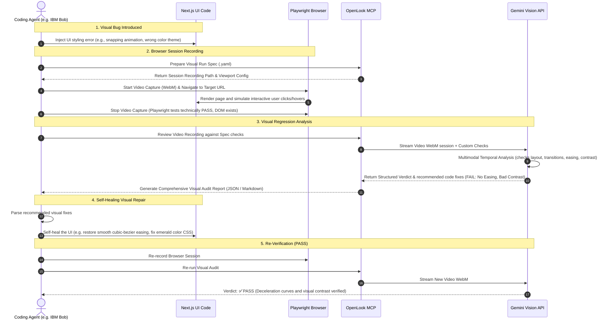

# OpenLook

<p align="center">
  
</p>

**What if your coding agent could see?**

AI agents write UI code every day. They can run tests, check types, and lint — but they have never been able to *look* at what they built. A button that technically renders can still be invisible. A page that passes every unit test can still confuse every user.

OpenLook gives coding agents vision. Write a visual test spec. The agent records its own browser session. Gemini watches the recording and judges whether the experience actually works — then tells the agent exactly what to fix.

It's unit testing for UX, built for the age of AI.

<div align="center">

```
spec → record → analyze → verdict
```

</div>

## How It Works

<p align="center">
  
</p>

<details>
  <summary>📊 View Raw Mermaid Sequence Source</summary>


</details>

```mermaid
sequenceDiagram
    participant Dev as Developer
    participant Agent as Coding Agent
    participant PW as Playwright MCP
    participant OL as OpenLook MCP
    participant Gemini as Gemini

    Dev->>Agent: "Run the visual tests"
    Agent->>Agent: Read .openlook/*.yaml specs
    Agent->>OL: openlook_prepare_run(spec)
    OL-->>Agent: recordingPath + startVideoArgs

    rect rgb(30, 30, 50)
        Note over Agent,PW: Browser Recording
        Agent->>PW: browser_start_video(startVideoArgs)
        Agent->>PW: navigate(url)
        Agent->>PW: scroll, click, observe
        Agent->>PW: browser_stop_video
        PW-->>Agent: saved .webm path
    end

    Agent->>OL: openlook_review(spec, recordingPath)

    rect rgb(40, 30, 30)
        Note over OL,Gemini: Visual Analysis
        OL->>Gemini: video + checks
        Gemini-->>OL: per-check pass/fail + reasoning
    end

    OL-->>Agent: verdict + fixes + report
    Agent-->>Dev: ✅ 2/3 passed · ❌ CTA not visible · Fix: increase contrast
```

## The Video Self-Healing Loop

Traditional automated tests check DOM selectors, but they are completely blind to motion, easing, color layout, and UX bugs. OpenLook enables a continuous **self-healing visual feedback loop** where agents detect visual bugs and fix their own UI code automatically.

<details>
  <summary>🔄 View Raw Detailed Self-Healing Loop Sequence Source</summary>


</details>

## Quick Start

### 1. Install the MCP server

```bash
npx -y openlook-mcp
```

### 2. Configure your agent

Add OpenLook and Playwright to your MCP config:

```json
{
  "mcpServers": {
    "openlook": {
      "command": "npx",
      "args": ["-y", "openlook-mcp"],
      "env": {
        "GEMINI_API_KEY": "your_key_here"
      }
    },
    "playwright": {
      "command": "npx",
      "args": ["-y", "@playwright/mcp@latest", "--caps=devtools"]
    }
  }
}
```

> `--caps=devtools` enables video recording in Playwright MCP.

### 3. Write a visual test

Create `.openlook/homepage.yaml` in your project:

```yaml
id: homepage-first-impression
url: http://localhost:3000

steps:
  - Open the homepage
  - Observe the first viewport without scrolling
  - Scroll once to see supporting content

checks:
  - id: value-prop-clear
    question: Can the user understand the product value from the first viewport?
    pass: The hero explains the product, who it is for, and why it matters.
    fail: The hero is vague, generic, or does not explain the product.

  - id: primary-action-visible
    question: Is the primary next action visually obvious?
    pass: One visually dominant CTA is easy to find near the hero.
    fail: No clear CTA, or multiple competing actions with equal weight.
```

### 4. Run it

Tell your agent: **"Run the visual tests"**

The agent reads the spec, records the browser session, sends the recording to Gemini, and reports back:

```
## OpenLook: homepage-first-impression

Verdict: FAIL ❌

| # | Check              | Status | Reasoning                                  |
|---|--------------------|--------|--------------------------------------------|
| 1 | value-prop-clear   | ✅     | Hero clearly explains the product value    |
| 2 | primary-action-visible | ❌ | Two buttons compete — no dominant CTA      |

### Recommended Fix
Increase the contrast and size of the primary CTA. Remove or visually demote the secondary action.
```

Fix the UI. Rerun the same spec. The test passes. Ship it.

## Why OpenLook?

Traditional testing asks: *does this component render?*

OpenLook asks: *does this experience work?*

| | Unit Tests | E2E Tests | **OpenLook** |
|---|---|---|---|
| **Tests** | Functions, logic | User flows, DOM state | Visual experience |
| **Judges** | Assert library | Playwright selectors | Gemini watching video |
| **Catches** | Logic bugs | Flow breakages | UX problems |
| **Written by** | Developer | Developer | Developer or agent |
| **Runs on** | Code | Browser DOM | Browser recording |

Problems OpenLook catches that traditional tests miss:
- The CTA exists but is visually invisible
- The page renders but is overwhelming
- The form works but the user can't figure out what to do
- The layout is technically correct but feels broken

## Spec Format

Every spec is a YAML file with three things: **where to go**, **what to do**, and **what to check**.

```yaml
id: onboarding-flow
url: http://localhost:3000/onboarding

steps:
  - Navigate to the onboarding page
  - Fill in the name field with "Jane"
  - Click the Continue button
  - Observe the next screen

checks:
  - id: progress-clear
    question: Does the user know where they are in the onboarding flow?
    pass: A progress indicator shows the current step and remaining steps.
    fail: No progress indicator, or the user cannot tell how far along they are.
```

**Fields:**
- `id` — test name
- `url` — page to test
- `viewport` — optional `{ width, height }`, defaults to 1440×900
- `steps` — browser actions the agent performs during recording
- `checks` — visual assertions Gemini evaluates from the recording

## Architecture

OpenLook is an MCP server that sits alongside Playwright MCP. Three systems, three jobs:


| System | Does | Does Not |
|---|---|---|
| **Your agent** | Reads specs, performs steps, reports results | Evaluate UI quality |
| **Playwright MCP** | Drives browser, records video | Analyze recordings |
| **OpenLook MCP** | Allocates paths, sends to Gemini, returns verdicts | Drive the browser |

## MCP Tools

### `openlook_prepare_run`

Prepares a recording directory and returns the exact arguments for Playwright's `browser_start_video`.

**Input:** `{ spec }` — the parsed YAML spec object.

**Returns:** `runId`, `recordingPath`, `startVideoArgs` (pass directly to `browser_start_video`), and `reviewArgs` (pass directly to `openlook_review` after recording).

### `openlook_review`

Sends a browser recording to Gemini for visual evaluation against the spec's checks.

**Input:** `{ spec, recordingPath, writeReport? }` — the spec, path to `.webm`, and whether to write `report.md`/`report.json`.

**Returns:** `verdict` (pass/fail/needs_review), per-check results with `✅`/`❌` status, reasoning, and recommended fixes. If `writeReport: true`, also returns the `reportDir` path.

## Project Structure

```
your-project/
  .openlook/              ← visual test specs (committed)
    homepage.yaml
    onboarding.yaml
  reports/                ← generated reports
    homepage-2026-.../
      report.md
      report.json
      recording.webm

~/.openlook/<project>/    ← run recordings (not committed)
  runs/
    homepage-2026-.../
      recording.webm
```

## OpenLook Skill

OpenLook includes a skill file that teaches coding agents the full workflow — how to read specs, drive the browser, and format results. Install the skill into your agent's skill directory:

```
.agents/skills/openlook/SKILL.md
```

The skill handles:
- Creating new visual test specs from user requests
- Running single specs or all specs in `.openlook/`
- Formatting results as markdown tables with reasoning and fixes

## Development

```bash
# Install dependencies
bun install

# Build the MCP server
bun run build:mcp

# Run locally (stdio mode)
node dist/src/index.js

# Run the website
bun run dev
```

## Environment Variables

| Variable | Required | Description |
|---|---|---|
| `GEMINI_API_KEY` | Yes | Google Gemini API key for video analysis |
| `GEMINI_MODEL` | No | Model override (default: `gemini-2.5-flash`) |

## Built With

- [IBM Bob](https://www.ibm.com/bob) — AI coding agent used to build this project
- [Google Gemini](https://ai.google.dev/) — multimodal AI for video analysis
- [Playwright MCP](https://github.com/nichochar/playwright-mcp) — browser automation and recording
- [Model Context Protocol](https://modelcontextprotocol.io/) — the standard connecting AI to tools

## License

MIT

---

<div align="center">

**Agents should be able to see the interfaces they create.**

[Install](https://www.npmjs.com/package/openlook-mcp) · [GitHub](https://github.com/system1970/openlook-web) · [Skill](https://github.com/system1970/openlook-web/tree/master/.agents/skills/openlook)

</div>
