```mermaid
sequenceDiagram
    participant Dev as Developer
    participant Bob as IBM Bob (Coding Agent)
    participant PW as Playwright MCP
    participant OL as OpenLook MCP
    participant Gemini as Gemini 2.5 Flash

    Dev->>Bob: "Verify the landing page UI looks right"
    Bob->>Bob: Read .openlook/*.yaml specs
    Bob->>OL: openlook_prepare_run(spec)
    OL-->>Bob: recordingPath + startVideoArgs

    rect rgb(20, 20, 30)
        Note over Bob,PW: Browser Recording Session
        Bob->>PW: browser_start_video(startVideoArgs)
        Bob->>PW: navigate("http://localhost:3000")
        Bob->>PW: scroll, observe, hover elements
        Bob->>PW: browser_stop_video
        PW-->>Bob: saved .webm video path
    end

    Bob->>OL: openlook_review(spec, recordingPath)

    rect rgb(30, 20, 20)
        Note over OL,Gemini: AI Multimodal Evaluation
        OL->>Gemini: Send video + spec checks
        Gemini-->>OL: Pass/Fail per check + reasoning & fixes
    end

    OL-->>Bob: Verdict + JSON & Markdown Reports
    Bob->>Dev: ✅ PASS: headline-clear · ❌ FAIL: cta-visible (Fix: increase size and contrast)
```

# IBM Bob Task Session Report: OpenLook

**Hackathon:** IBM Bob Hackathon (Lablab.ai)  
**Timeline:** May 15 – May 17, 2026  
**Project Name:** OpenLook  
**AI Developer Partner:** IBM Bob (Advanced Agentic Coding Agent)  
**Goal:** Empower AI coding agents to visually unit-test their own UI builds by closing the visual loop.

---

## 1. The Core Bottleneck: "Blind" AI Coding

Every day, software agents write thousands of lines of React, HTML, and CSS. They can run unit tests, check TypeScript types, compile code, and lint. But until now, they have been completely **blind** to the actual visual output.
* A button that technically renders in the DOM can still be completely invisible (same color as the background).
* A page that passes every Playwright selector test can still look extremely cluttered or confusing to a human.
* Layout elements can overlap, fonts can be broken, and contrast can make CTA buttons completely unreadable.

**OpenLook solves this.** It gives AI coding agents standard vision capabilities, letting them record browser sessions, evaluate them against visual test specs using Gemini, and receive actionable pass/fail verdicts with recommended code fixes to self-heal their UI.

---

## 2. Product Architecture & Workflow

OpenLook implements a standard **Model Context Protocol (MCP) server** that works in tandem with **Playwright MCP** to allow agents to drive browsers, record evidence, and review UX.

```
spec → openlook_prepare_run → Playwright records .webm → openlook_review → Gemini watches → pass/fail
```



---

## 3. IBM Bob Engineering & Development Milestones

Throughout the 48-hour hackathon, IBM Bob operated as a collaborative partner, driving the project from raw concepts to a production-ready codebase:

### 🚀 Milestone 1: MCP Server Core Foundation
*   **Action:** Initialized the TypeScript MCP server using `@modelcontextprotocol/sdk` and Bun.
*   **Result:** Created the robust tool framework in [mcp-server.ts](file:///c:/Users/pracu/OneDrive/Desktop/2026/IBM%20Bob%20Hackathon/src/lib/mcp-server.ts) with four specialized operations: `openlook_prepare_run`, `openlook_review`, and session tracking.

### 📝 Milestone 2: Strict Visual Spec Engine
*   **Action:** Developed strict validation schemas using **Zod** to ensure visual tests are typed, clear, and deterministic.
*   **Result:** Established [types.ts](file:///c:/Users/pracu/OneDrive/Desktop/2026/IBM%20Bob%20Hackathon/src/lib/types.ts) which defines the YAML specs with `id`, `url`, `steps`, and a flat list of `checks` (id, question, pass, fail).

### 👁️ Milestone 3: Google GenAI Multimodal Evaluation
*   **Action:** Wired the `@google/genai` (v2.0.1+) SDK into the review loop, writing prompts that instruct Gemini to act as a rigorous QA engineer reviewing browser video recordings.
*   **Result:** Implemented [gemini.ts](file:///c:/Users/pracu/OneDrive/Desktop/2026/IBM%20Bob%20Hackathon/src/lib/gemini.ts), returning structured JSON containing pass/fail verdicts, reasoning, and automated code-fix suggestions for each visual assertion.

### 🎨 Milestone 4: Marketing Page & Landing Page Creation
*   **Action:** Built the OpenLook landing page inside `app/page.tsx` using **Next.js**, **React**, and sleek dark mode **Tailwind CSS**.
*   **Result:** Standardized a beautiful developer-centric landing page documenting the spec format, workflow, install steps, and visual preview cards.

### 💎 Milestone 5: The Minimalist Design Pivot (Adhering to Claude's Philosophy)
*   **Action:** Initially integrated heavy Three.js 3D WebGL geometries and complex cosmic wisp fluid shaders. However, based on direct developer review, we recognized that visual "slop" was distracting from the core developer utility of the product.
*   **Result:** Executed a clean visual pivot—completely removing the WebGL components and adopting an ultra-minimalist, high-contrast matte black layout reminiscent of Cursor's pristine aesthetic.

### 🎬 Milestone 6: The Motion Graphic Visual Unit Testing Showcase
*   **Action:** Traditional testing frameworks like Playwright are blind to animation, movement, easing, and visual states. To demonstrate OpenLook's core vision, we created an interactive, ultra-premium `MotionGraphic` component built with hardware-accelerated transitions and natural spring ease-out curves (`cubic-bezier(0.16, 1, 0.3, 1)`) matching Vercel/Linear's high-fidelity aesthetic.
*   **The Visual Regression Test Loop:**
    1.  **Introduce Visual Bug:** Disabled the custom verdict cubic-bezier slide-in transition and overrode the verdict badge in `app/components/MotionGraphic.tsx` to render a flat, red `❌ FAIL` state that snapped instantly into view.
    2.  **Visual Run:** Recorded a 15-second browser session WebM using Playwright MCP.
    3.  **Visual Audit:** Ran the visual regression suite using `openlook_review`. Gemini audited the temporal video stream, flagged a **FAIL** on all checks, and identified both the exact transition easing failure and badge styling mismatch!
    4.  **Self-Healing:** Based on Gemini's visual recommendation, the agent (IBM Bob) restored the `verdictSlideIn` cubic-bezier transition rules and corrected the styling to emerald green PASS classes.
    5.  **Verified:** Reran the test recording. The visual suite achieved a perfect **✅ PASS** across all temporal and animation-based visual assertions!

---

## 4. OpenLook Spec Implementation

OpenLook specs are flat, highly scannable YAML files stored under `.openlook/` in the project root:

### `.openlook/hero-motion-graphic.yaml`
```yaml
id: homepage-motion-graphic
url: http://localhost:3000

viewport:
  width: 1440
  height: 900

steps:
  - Navigate to the homepage
  - Wait 15 seconds to observe the entire 4-phase motion graphic loop
  - Verify spec load, cursor movement, laser scanning, and final verdict easing

checks:
  - id: temporal-phase-transition
    question: Does the recorded video capture smooth temporal transitions between the YAML IDE editor phase and the browser mockup phase?
    pass: The video captures the screen shifting seamlessly from the YAML code editor (at around 2-3s) to the active browser mockup (at around 5-6s) without stuttering.
    fail: The layout freezes on one phase, stutters severely, or fails to transition between the different phases.

  - id: cursor-movement-inertia
    question: Does the simulated vector cursor slide smoothly with organic visual inertia across the mockup viewport?
    pass: The white cursor moves in a continuous, curved trajectory, easing dynamically toward the primary selector button without skipping frames or jittering.
    fail: The cursor remains completely static, lags, or snaps abruptly between coordinates.

  - id: verdict-slide-up-easing
    question: Does the final visual verdict card animate into view with a smooth slide-up and scale transition using exponential deceleration?
    pass: The green verdict card glides up from the bottom of the canvas, scaling smoothly with natural ease-out deceleration (representing clean cubic-bezier motion).
    fail: The card snaps into existence instantly, lacks scaling/sliding easing, or has rendering artifacts.
```

### `.openlook/hero-minimalist-design.yaml`
```yaml
id: homepage-hero-minimalist
url: http://localhost:3000

viewport:
  width: 1440
  height: 900

steps:
  - Navigate to the homepage
  - Observe the hero section without scrolling

checks:
  - id: hero-minimalist-aesthetic
    question: Is the hero clean, centered, and minimalist with a plain dark backdrop?
    pass: The hero has a pure dark, matte background with a clean, centered headline, a description, and elegant CTA buttons. There are no distracting or cluttered elements.
    fail: The background is cluttered, noisy, or contains visually competing elements.

  - id: centered-typography-legible
    question: Is the centered typography perfectly readable with excellent contrast?
    pass: The white headline and muted description are centered and stand out with maximum contrast against the pure dark background.
    fail: The text is hard to read, has low contrast, or is cut off.

  - id: primary-action-dominant
    question: Is the primary "Get started" CTA visually distinct and dominant?
    pass: The primary "Get started" button has a high-contrast white fill with black text, making it stand out as the dominant next action next to the secondary outline button.
    fail: No dominant button, or both buttons share the same low-contrast outline styling.
```

---

## 5. Lablab.ai Submission Deliverables Catalog

To deliver a winning solution according to the **lablab.ai submission guidelines**, our repository is prepared with the following resources:

1.  **Functional Landing Page Demo:** Hosted and optimized for deployment (e.g., Vercel), highlighting OpenLook’s value proposition.
2.  **Public GitHub Repository:** Maintained with clean directories, comprehensive `README.md`, and strict `.gitignore` rules preventing any API key leakage.
3.  **Comprehensive Visual Specs:** Pre-loaded in `.openlook/` so judges and users can run visual regression tests immediately out-of-the-box.
4.  **IBM Bob Session Report:** (This file) Documenting the development journey, agent cooperation, and design iterations to provide complete evidence of agentic coding productivity.

---

*This report was generated collaboratively by the user and IBM Bob, proving the productivity multipliers of advanced AI pair-programming in agentic software engineering.*
