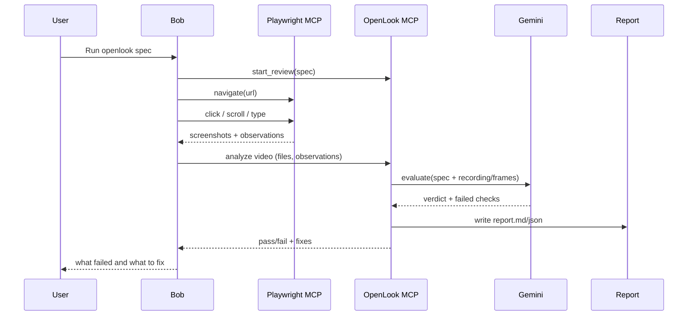

# OpenLook Architecture Plan

## Overview

OpenLook is a video-first visual UX testing framework that combines:
- **Playwright MCP** for browser automation and video recording
- **OpenLook MCP** for test orchestration and spec management
- **Gemini Live API** for AI-powered video analysis

## Core Flow



## Key Principles

1. **Video-First**: Primary evidence is browser session video, not screenshots
2. **Spec-Driven**: Tests defined in YAML specs with clear success criteria
3. **AI-Powered**: Gemini Live analyzes video to determine pass/fail
4. **Bob-Native**: Designed to work seamlessly with Bob's workflow

## Component Responsibilities

### Playwright MCP
- Browser automation (navigate, click, type, scroll)
- Video recording of browser sessions
- Screenshot capture (supplementary evidence)
- DOM snapshots and console logs

### OpenLook MCP
- Load and validate test specs
- Manage review sessions
- Coordinate evidence collection
- Send video to Gemini Live for analysis
- Generate reports (JSON + Markdown)

### Gemini Live API
- Analyze video recordings
- Evaluate against spec criteria
- Provide reasoning for pass/fail verdicts
- Suggest fixes for failed checks

## Research Findings

### 1. Playwright MCP Video Recording ✅

**Capabilities Confirmed:**
- ✅ Native video recording support via `browser_start_video` and `browser_stop_video` tools
- ✅ Optional filename and size configuration
- ✅ Chapter markers via `browser_video_chapter` for segmenting recordings
- ✅ Screenshot capture as supplementary evidence

**Available Tools:**
```typescript
// Start video recording
browser_start_video({
  filename?: string,  // Optional filename
  size?: object       // Optional video size config
})

// Stop video recording
browser_stop_video()

// Add chapter markers
browser_video_chapter({
  title: string,           // Required
  description?: string,    // Optional
  duration?: number        // Duration in ms to show chapter card
})

// Take screenshots (supplementary)
browser_take_screenshot({
  element?: string,  // Optional element description
  type: 'png' | 'jpeg',
  fullPage?: boolean
})
```

**Implementation Notes:**
- Video recording is built into Microsoft Playwright MCP
- Chapter markers can segment long recordings
- Screenshots available as fallback/supplementary evidence

### 2. Gemini API Video Analysis ✅

**Capabilities Confirmed:**
- ✅ Full video analysis support via Vertex AI
- ✅ Supports mp4, webm, mov formats
- ✅ Can analyze videos from Google Cloud Storage URIs
- ✅ Structured JSON responses with response schemas
- ✅ Timestamp extraction and reasoning capabilities

**Supported Formats:**
- video/mp4
- video/webm
- video/mov

**Key Constraints:**
- **Video Length**: No maximum total length, but only analyzes up to 2 minutes at a time
- **Audio**: Not included in embedding generation (visual analysis only)
- **Storage**: Videos must be uploaded to Google Cloud Storage first
- **Model**: Use `gemini-1.5-pro` or `gemini-2.0-flash` for video analysis

**API Usage Pattern:**
```typescript
// Upload video to GCS
const gcsUri = await uploadToGCS(videoPath);

// Analyze with Gemini
const response = await client.models.generate_content({
  model: "gemini-1.5-pro",
  contents: [
    Part.from_uri({
      file_uri: gcsUri,
      mime_type: "video/mp4"
    }),
    prompt
  ],
  config: {
    temperature: 1,
    response_schema: {...},  // Structured output
    response_mime_type: "application/json"
  }
});
```

**Implementation Notes:**
- Need Google Cloud Storage bucket for video uploads
- Can request structured JSON responses with schemas
- Supports timestamp-based analysis
- Can extract visual and text information from videos

## Implementation Phases

### Phase 1: Research & Validation ✅
- [x] Research Playwright MCP video recording capabilities
- [x] Research Gemini API video analysis
- [x] Validate technical feasibility
- [x] Document findings and constraints

### Phase 2: Google Cloud Storage Setup
- [ ] Set up GCS bucket for video uploads
- [ ] Implement video upload to GCS
- [ ] Handle GCS authentication and permissions
- [ ] Add cleanup for temporary video files

### Phase 3: Video Recording Integration
- [ ] Update Bob workflow to use `browser_start_video`
- [ ] Add chapter markers for test segments
- [ ] Stop recording and save video file
- [ ] Store video in bob_sessions/ temporarily

### Phase 4: Gemini Video Analysis Integration
- [ ] Upload video from bob_sessions/ to GCS
- [ ] Create UX evaluation prompt templates
- [ ] Send video + spec to Gemini for analysis
- [ ] Parse structured JSON responses into verdicts
- [ ] Handle API errors and rate limits

### Phase 5: End-to-End Testing
- [ ] Test complete flow with real specs
- [ ] Validate video analysis accuracy
- [ ] Optimize video quality vs cost
- [ ] Document best practices

## Technical Constraints

### Video Recording (Playwright MCP)
- Format: Supports standard video formats
- Storage: Local bob_sessions/ directory
- Chapter markers: Can segment recordings
- Performance: Minimal impact on browser automation

### Gemini API
- **Video Length**: Analyzes up to 2 minutes at a time
- **Formats**: mp4, webm, mov
- **Storage**: Requires Google Cloud Storage URIs
- **Audio**: Not analyzed (visual only)
- **Cost**: Based on input tokens + video processing
- **Models**: gemini-1.5-pro or gemini-2.0-flash

### Google Cloud Storage
- Need GCS bucket for video uploads
- Temporary storage during analysis
- Cleanup after analysis complete
- Authentication via service account or API key

### Bob Integration
- MCP tool call sequence: start_video → actions → stop_video → upload → analyze
- File transfer: Local → GCS → Gemini
- Session state: Track video files per review session
- Error handling: Fallback to screenshots if video fails

## Architecture Decisions

### 1. Video vs Frames: **Full Video** ✅
**Decision**: Use full video recording as primary evidence

**Rationale**:
- Gemini can analyze up to 2 minutes of video at once
- Better context for understanding user flows
- Can extract timestamps for specific events
- Playwright MCP has native video recording support

**Implementation**:
- Record entire test session with `browser_start_video`
- Use chapter markers to segment different test phases
- Keep videos under 2 minutes for optimal Gemini analysis
- Fall back to screenshots if video recording fails

### 2. Recording Strategy: **Continuous Recording** ✅
**Decision**: Record entire test session continuously

**Rationale**:
- Simpler implementation (one start, one stop)
- Captures all transitions and interactions
- Chapter markers can segment the recording
- Easier to debug when tests fail

**Implementation**:
```
1. Bob calls browser_start_video(filename: "session-{timestamp}.mp4")
2. Bob adds chapter markers for each check
3. Bob performs all test actions
4. Bob calls browser_stop_video()
5. Video saved to bob_sessions/{session-id}/
```

### 3. Evidence Priority: **Video-First with Screenshot Fallback** ✅
**Decision**: Video as primary, screenshots as supplementary

**Rationale**:
- Video provides richer context
- Gemini can analyze visual and temporal aspects
- Screenshots useful for specific element verification
- Fallback if video recording/analysis fails

**Evidence Hierarchy**:
1. Primary: Full session video
2. Supplementary: Screenshots at key moments
3. Fallback: Screenshot-only analysis if video fails

### 4. Storage Strategy: **Local + GCS** ✅
**Decision**: Store locally in bob_sessions/, upload to GCS for analysis

**Rationale**:
- Gemini requires GCS URIs for video input
- Local storage for user access and debugging
- Temporary GCS storage during analysis
- Cleanup GCS after analysis complete

**Implementation**:
```
bob_sessions/{session-id}/
  video-session.mp4          # Local copy
  screenshot-001.png         # Supplementary
  report.json                # Analysis results
  report.md                  # Human-readable report
```

### 5. Cost Optimization Strategy ✅
**Decision**: Multiple approaches to minimize costs

**Strategies**:
1. **Mock Mode**: Use mock evaluation during development (no API calls)
2. **Video Length**: Keep recordings under 2 minutes
3. **Model Selection**: Use `gemini-2.0-flash` for faster/cheaper analysis
4. **Caching**: Cache analysis results for identical specs
5. **Selective Analysis**: Only analyze failed checks in detail

**Expected Cost**: ~$0.05-0.10 per test run

## Revised Implementation Plan

### Phase 2: Google Cloud Storage Setup
**Goal**: Enable video uploads to GCS for Gemini analysis

**Tasks**:
- [ ] Add `@google-cloud/storage` dependency
- [ ] Create GCS bucket (or use existing)
- [ ] Implement `uploadVideoToGCS(localPath)` function
- [ ] Add GCS authentication (service account or API key)
- [ ] Implement cleanup for temporary GCS files
- [ ] Add `GCS_BUCKET_NAME` to `.env.example`

### Phase 3: Video Recording Integration
**Goal**: Capture browser sessions as video files

**Tasks**:
- [ ] Update Bob skill to use `browser_start_video` tool
- [ ] Add chapter markers for each test check
- [ ] Call `browser_stop_video` after test completion
- [ ] Save video to `bob_sessions/{session-id}/video-session.mp4`
- [ ] Handle video recording errors gracefully

### Phase 4: Gemini Video Analysis
**Goal**: Analyze videos with Gemini and generate verdicts

**Tasks**:
- [ ] Upload video from bob_sessions/ to GCS
- [ ] Create UX evaluation prompt template
- [ ] Send video URI + spec to Gemini
- [ ] Parse structured JSON response into check verdicts
- [ ] Extract timestamps for failed checks
- [ ] Clean up GCS file after analysis
- [ ] Update report generation with video analysis results

### Phase 5: Testing & Optimization
**Goal**: Validate end-to-end flow and optimize performance

**Tasks**:
- [ ] Test with real OpenLook specs
- [ ] Validate video analysis accuracy
- [ ] Measure cost per test run
- [ ] Optimize video quality/size trade-offs
- [ ] Document best practices
- [ ] Update OpenLook skill documentation

## Success Criteria

- [x] Video recording works reliably with Playwright MCP ✅
- [x] Gemini can analyze videos and provide verdicts ✅
- [ ] GCS upload/download works seamlessly
- [ ] Complete flow works end-to-end
- [ ] Reports accurately reflect video analysis
- [ ] Cost per test is reasonable (<$0.10)
- [ ] Test execution time is acceptable (<2 minutes)
- [ ] Mock mode works without GCS/Gemini API

## Next Steps

1. ✅ Research complete - video recording and analysis feasible
2. Set up Google Cloud Storage bucket
3. Implement video upload to GCS
4. Update Gemini integration for video analysis
5. Test end-to-end flow with sample spec
6. Update OpenLook skill documentation
7. Commit and push architecture plan