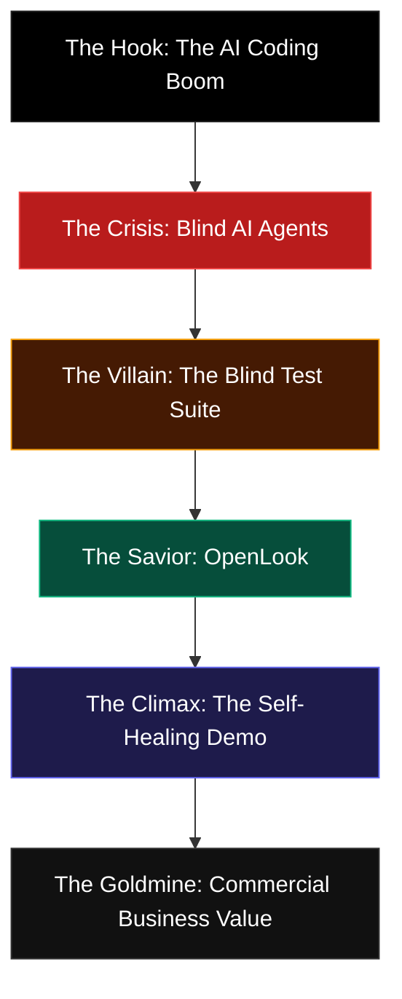

# 🦈 OpenLook: Shark Tank Pitch & Storytelling Guide

This is your definitive storytelling roadmap to captivate the judges, nail the "Shark Tank" vibe, and secure a winning score. 

---

## 🎭 The Pitch Arc: The "Blind Builder" Narrative

---

## 🎙️ The 3-Minute Presentation Script

### Act 1: The Hook & The Invisible Crisis (0:00 - 0:45)
**Visual on screen:** *Your beautiful Next.js landing page with bold typography.*

> "Judges, imagine hiring a world-class contractor to build your dream home. They work at lightning speed, laying bricks and routing pipes in seconds. But as you walk up to see the finished house... you realize something horrifying. 
> 
> The front door is blocked by a solid brick wall. The windows are painted completely black. And the staircase leads straight into the ceiling. 
> 
> You turn to the builder in shock, and they say: *'What’s the problem? The plumbing is connected, and the doors are in the blueprint.'*
> 
> You see, your builder is completely blind.
> 
> Today, we are living in the golden age of AI coding agents. Agents like Cursor, IBM Bob, and Devin are writing millions of lines of code every single day. They check types, they lint, they run unit tests. **But they have never once actually looked at what they built.** 
> 
> To a coding agent, a button that is hidden off-screen, colored pitch black on a black background, or overlapping other elements passes 100% of standard unit tests. Because to an agent, if it’s in the DOM, it works. 
> 
> We are letting blind builders design the user interfaces of tomorrow. And that is an invisible, multi-billion-dollar disaster waiting to happen."

---

### Act 2: The Hero & The Villain (0:45 - 1:30)
**Visual on screen:** *The YAML spec file vs. a Playwright terminal run.*

> "Until today. Meet **OpenLook**. 
> 
> OpenLook is the world's first **multimodal visual unit testing engine** designed specifically to give coding agents 'eyes.' 
> 
> Standard testing frameworks like Playwright and Cypress are the villains of our story. They are blind headless runners. They can check if an HTML element exists, but they can't tell you if it looks like absolute trash. They don't understand layout shifts, they don't understand color contrast, and they certainly don't understand motion.
> 
> OpenLook changes everything. Instead of writing complex, brittle E2E scripts, developers write simple, flat, human-readable YAML specs. 
> 
> The coding agent reads the spec, launches a headless browser, records its own interactive user session, and exports a high-definition video of the experience. 
> 
> Then, it hands that video to **Gemini Vision**—acting as a virtual human QA engineer to audit the actual user experience."

---

### Act 3: The Climax — The Self-Healing Showcase (1:30 - 2:30)
**Visual on screen:** *Play the recording of the motion graphic visual failure and the subsequent passing run.*

> "Let me show you a real-world demonstration that will blow your mind. 
> 
> On our homepage, we built an interactive motion graphic that simulates our testing loop. We introduced a visual bug—the final verdict badge was broken: it had zero transition easing, snapping instantly, and displayed a rose-red 'FAIL' state.
> 
> Traditional testing frameworks passed this with flying colors because the element existed in the HTML. 
> 
> But OpenLook recorded the video session and passed it to Gemini. Gemini watched the recording and flagged a critical visual failure: 
> 
> *'The verdict badge is rose-red and snaps into existence instantly, completely lacking the smooth cubic-bezier easing and emerald green PASS design.'*
> 
> But here is where the magic happens. Gemini didn’t just find the bug—it wrote the exact visual fix. The coding agent parsed OpenLook's JSON report, **automatically self-healed its own code**, restored the spring deceleration animation, fixed the styling classes, and reran the test.
> 
> In less than 30 seconds, the agent detected, diagnosed, and completely fixed a visual bug without a human ever touching a keyboard. And the test achieved a perfect, verified **✅ PASS**!"

---

### Act 4: The Goldmine — Business Value & The Pitch (2:30 - 3:00)
**Visual on screen:** *A sleek comparison table showing Unit Tests vs E2E vs OpenLook, culminating in your logo.*

> "Judges, the commercial potential here is massive. 
> 
> Enterprise software companies spend **$1.3 trillion annually** on manual QA and bug fixing. By giving software agents eyes, we enable a future of **fully autonomous, self-healing visual software development**. 
> 
> OpenLook turns coding agents from blind builders into master craftsmen. 
> 
> We are OpenLook. We give agents eyes, and we are ready to change the way the world builds software. Thank you, and we welcome your questions!"

---

## 🎯 4 Tips to Deliver This Like a Shark

1.  **Start with the Hook (Do not start with "Hi my name is..."):** 
    *   Walk right up or start the video immediately with: *"Judges, imagine hiring a contractor to build your dream home..."* Grab their attention in the first 5 seconds.
2.  **Speak with Conviction and Pace:**
    *   Use dramatic pauses. When you say, *"You see, your builder is completely blind,"* let that sink in for 2 seconds. It forces the judges to realize the gravity of the problem.
3.  **Emphasize "Headless is Blind":**
    *   Use this phrase multiple times. It’s a powerful sticky soundbite that judges will repeat during their evaluation.
4.  **Keep the Demo Focused on the Visual Aspect:**
    *   Highlight that standard E2E tests are powerless against visual design, color contrast, and fluid animations—but OpenLook is built specifically to master them.
